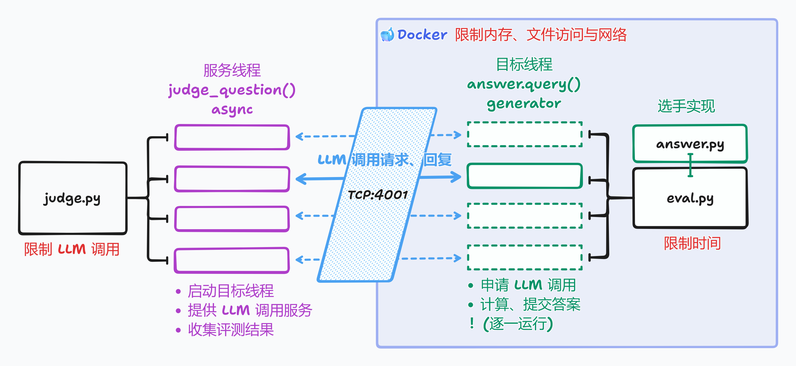

# 未央城评测中心

## 开始比赛

解压你得到的压缩包，文件夹里会有这些文件：

```plaintext
weyoungcity.zip
├── common.py
├── data.py
├── eval.py
├── judge.py
├── local_judge.py
├── problem0
│   ├── answer.py
│   ├── answer_zero.py
│   ├── imgs
│   │   └── [*].png
│   ├── __init__.py
│   └── qa_final.json
├── problem1
│   ├── answer.py
│   ├── answer_zero.py
│   └── __init__.py
├── pyproject.toml
├── README.md
└── uv.lock
```

运行评测程序需要先安装 python 环境。推荐把所有包装在一个虚拟环境（venv）里，Windows 系统下如下操作：

```powershell
python -m venv .venv              # create venv in folder .venv
.\.venv\Scripts\activate.ps1      # activate venv, the next pip will come from .venv
pip install -e .                  # install dependencies from 'pyproject.toml' in editable mode
```

Linux 下换成：

```bash
python -m venv .venv
source .venv/bin/activate
pip install -e .
```

然后添加你的 API 密钥。在该目录下创建一个文件 `key.json`，如下填写：

```json
{
  "api_key": "$你的 API 密钥",
  "base_url": "$API 域名，如 https://llmapi.paratera.com/v1"
}
```

然后启动本地评测脚本，即可开始评测：

```bash
python local_judge.py --help # 帮助文档
python local_judge.py --problem 0 --jobs 12 # 测试问题A，十二线程并发
```

你的任务是修改每个文件夹下的 answer.py，使你的分数尽可能高。

## 你的程序做什么？

你的程序需要实现 `answer.query()` ，它是一个 [Python Generator](https://docs.python.org/3/reference/expressions.html#yield-expressions)（用法可见此 [gist](https://gist.github.com/kolypto/3240037e46bce47d4374331decc298f1)），相当于一个可以暂停的程序。

【TODO：用图片形式描述你的程序与评测程序在干啥】

在我们的赛题中：

- 评测程序会对每个数据点调用一次 `answer.query`。
- 你需要用 `yield` 提交 `Action` 向服务程序示意调取功能，比如用 `yield CompleteAction()` 调用 LLM 文本补全。`yield` 的返回值是功能调用的结果。
- 用 `return` 返回该数据点的答案，服务程序会标记其为 `AC`（答案正确）或 `WA`（答案错误）。
- 如果运行过程中发生异常，服务程序会标记 `RE`（运行时错误）。
- 如果运行超限，服务程序会标记 `TLE`（超时），`LULE`（LLM 调用超限）等错误。

最终你的分数就是你的准确率，也就是获得 `AC` 的数据点占所有数据的比例。

【TODO：每一个 `Action` 干啥】

值得注意的是：

- 函数外的全局变量（如例程里的 `prompt` 字符串）由所有调用共享，函数内的变量在本次调用中有效。因此，**修改全局变量可能带来意外的 bug**！
- 【TODO：更多注意事项】

如果有不清楚的地方，可以试着跑跑样例，或者发微信咨询管理赛事的同学们。

## 如何评测？

以下把你提交，实现赛题功能的程序叫做“目标程序”。评测程序架构大致如图所示。



启动主评测程序 `judge.py` 后，每次提交，它会启动一个新的 Docker 容器，将选手提交的程序保存至 `answer.py`，运行副评测程序 `eval.py`。随后，`judge.py` 启动若干服务线程，每个线程负责评测一组数据。

二评测程序在 `127.0.0.1:4001` 端口通过 tcp 通信。服务线程 `judge_question` 会向 `eval.py` 发送 `Request`，`eval.py` 执行对应的操作并返回 `Response`。协议如下：

1. 服务线程发送 `StartReq`，描述评测的问题。`eval.py` 在一个线程中启动目标程序，返回 `OkRes`。
2. 服务线程发送 `ContinueReq`，内含传给目标线程的返回值。`eval.py` 将返回值传给目标线程，获取目标线程的下一个 `Action`，返回 `OkRes`。
   重复执行此操作，直到：
3. 若目标线程运行结束（抛出 `StopIteration` 异常），读取返回值，返回 `DoneRes`。
4. 若目标线程出现其他异常，返回 `ErrRes`。

值得注意的是：

- 各评测程序共同限制目标程序的资源使用。
- 为了加快评测，`judge.py` 启动多个服务线程，以并行调用 API。默认最多同时运行 24 个服务线程，目标线程与其一一对应。
- 为了计时公平，`eval.py` 同一时刻至多只运行一个目标线程，其余已启动的线程处于休眠状态。
- 内存限制 128MB 限制的是整个 Docker 容器的总内存。时间限制 4s 限制的是每个目标线程的总运行时长，调用服务线程不算时间。
- 找出 bug 者大概有赏。

【TODO：我们大概需要储存一些 log，关于选手提交的答案，方便申诉？中间过程大概可以不存，主要图片太多。】

## TODO：文件说明

## 维护说明

按照部署说明添加完 git 配置后，上传代码只需要两步。

```bash
# on your computer:
git push prod
# on the server:
git pull
```

## 部署说明

这里描述我们如何在服务器上运行评测程序。

### 配置硬件软件

TODO：什么硬件配置？网络？评测速度如何？

TODO：什么软件配置？

git, python 3.11.13, docker 版本……

TODO: 服务器上需要怎么配置网络？见 <https://stackoverflow.com/a/64464693>，其中出现的几个 ip 是私有的。

### 把评测程序搬到服务器上

我们的代码放在 `/app` 下，包含代码文件夹 `/app/weyoungcity` 与 git bare repo `/app/weyoungcity.git`。

在 `/app/weyoungcity.git` 创建一个 [git bare repo](https://ratfactor.com/cards/git-bare-repos)。

```bash
cd /app
mkdir weyoungcity.git
cd /app/weyoungcity.git
git init --bare
```

在开发电脑里的 `.git/config` 里添加如下设置：

```toml
[remote "prod"]
  url = ssh://username@server/app/weyoungcity.git
```

然后运行 `git push prod`，代码就跑到了服务器上！

随后在服务器上运行：

```bash
cd /app
git clone weyoungcity.git
```

这会创建代码文件夹 `/app/weyoungcity`。

### 配置软件环境

python 环境与选手的配置方法类似。

```bash
python3.11 -m venv .venv
source .venv/bin/activate
pip install -e .[prod]
```

docker 环境使用：

```bash
docker build -t judged .
```

### 保证代码一直运行

TODO: 一个 systemd 配置。
