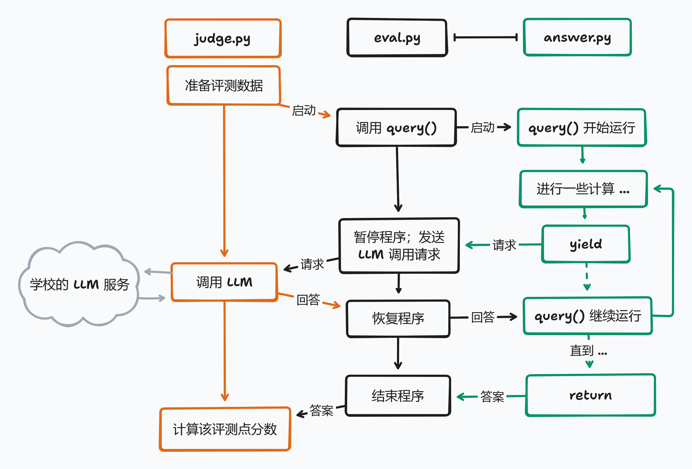

# 未央城评测中心

## 开始比赛

解压你得到的压缩包，文件夹里会有这些文件：

```plaintext
weyoungcity.zip
├── common.py
├── data.py
├── eval.py
├── judge.py
├── local_judge.py
├── problem0
│   ├── answer.py
│   ├── __init__.py
│   ├── qa_final.json
│   └── imgs
│       ├── ...
├── problem1
│   ├── answer.py
│   ├── __init__.py
│   ├── MVBench_qa.json
│   └── videos
│       ├── ...
├── problem2
│   ├── answer.py
│   ├── __init__.py
│   ├── qwen2-vl-7b-fine-tune.jsonl
│   └── O3DVQA
│       └── ...
├── pyproject.toml
├── README.md
└── uv.lock
```

运行评测程序需要先安装 python 环境。推荐把所有包装在一个虚拟环境（venv）里，Windows 系统下如下操作：

```powershell
python -m venv .venv              # create venv in folder .venv
.\.venv\Scripts\activate.ps1      # activate venv, the next pip will come from .venv
pip install -e .                  # install dependencies from 'pyproject.toml' in editable mode
```

Linux 下换成：

```bash
python -m venv .venv
source .venv/bin/activate
pip install -e .
```

然后添加你的 API 密钥。在该目录下创建一个文件 `key.json`，如下填写：

```json
{
  "api_key": "$你的 API 密钥",
  "base_url": "$API 域名，如 https://llmapi.paratera.com/v1"
}
```

然后启动本地评测脚本，即可开始评测：

```bash
python local_judge.py --help # 帮助文档
python local_judge.py --problem 0 --jobs 12 # 测试问题A，十二线程并发
```

你的任务是修改每个文件夹下的 answer.py，使你的分数尽可能高。

## 你的程序做什么？

你的程序需要实现 `answer.query()` ，它是一个 [Python Generator](https://docs.python.org/3/reference/expressions.html#yield-expressions)（用法可见此 [gist](https://gist.github.com/kolypto/3240037e46bce47d4374331decc298f1)），相当于一个可以暂停的程序。



在我们的赛题中：

- 评测程序会对每个数据点调用一次 `answer.query`。
- 你需要用 `yield` 提交 `Action` 请求，向服务程序示意调取功能。比如 `yield CompleteAction()` ，表示需要调用 LLM 文本补全。`yield` 语句的返回值会是功能调用的结果。
- 用 `return` 返回该数据点的答案，服务程序会将其判为 `AC`（答案正确）或 `WA`（答案错误）。
- 如果运行过程中发生异常，服务程序会将其判为 `RE`（运行时错误）。
- 如果运行超限，服务程序会将其判为 `TLE`（运行时间超过 4s）或`LULE`（LLM 调用次数超过 10 次）。

最终你的分数就是你的正确率向下取整，也就是获得 `AC` 的数据点占所有数据的比例。

目前能进行的请求只有 `common.CompleteAction(messages, kwargs)`，表示调用 LLM 文本补全功能，得到的参数会被原样填入 `client.chat.completions.create` 中。

```python
# in your program:
result = yield common.CompleteAction(
    messages=PROMPT_MESSAGES,
    kwargs={
      "temperature": 0,
      "response_format": {"type": "json_object"},
    },
)
# judge.py will call the llm, so this is equivalent to:
result = client.chat.completions.create(
    model="Qwen2.5-VL-72B-Instruct",
    messages=PROMPT_MESSAGES,
    temperature=0,
    response_format={"type": "json_object"},
)
```

值得注意的是：

- `answer.query()` 每次运行至多调用 **10** 次 llm，否则该数据点被判为`LULE`。因此，你只能通过 yield 请求评测程序调用 llm 服务，不能自己调用，**否则算犯规！**
- 函数外的全局变量（如例程里的 `prompt` 字符串）由所有调用共享，函数内的变量在本次调用中有效。因此，**修改全局变量可能带来意外的 bug**！

如果有不清楚的地方，可以试着跑跑样例程序，或者发微信咨询管理赛事的同学们。

---

如果你是一个参赛选手，阅读以上内容就够了。但如果你想知道评测程序具体是怎么工作的，请继续往下阅读……

## 如何评测？

以下把你提交，实现赛题功能的程序叫做“目标程序”。评测程序架构大致如图所示。


启动主评测程序 `judge.py` 后，每次提交，它会启动一个新的 Podman 容器，将选手提交的程序保存至 `answer.py`，运行副评测程序 `eval.py`。随后，`judge.py` 启动若干服务线程，每个线程负责评测一组数据。

二评测程序在 `127.0.0.1:4001` 端口通过 tcp 通信。服务线程 `judge_question` 会向 `eval.py` 发送 `Request`，`eval.py` 执行对应的操作并返回 `Response`。协议如下：

1. 服务线程发送 `StartReq`，描述评测的问题。`eval.py` 在一个线程中启动目标程序，返回 `OkRes`。
2. 服务线程发送 `ContinueReq`，内含传给目标线程的返回值。`eval.py` 将返回值传给目标线程，获取目标线程的下一个 `Action`，返回 `OkRes`。
   重复执行此操作，直到：
3. 若目标线程运行结束（抛出 `StopIteration` 异常），读取返回值，返回 `DoneRes`。
4. 若目标线程出现其他异常，返回 `ErrRes`。

值得注意的是：

- 各评测程序共同限制目标程序的资源使用。
- 为了加快评测，`judge.py` 启动多个服务线程，以并行调用 API。默认最多同时运行 48 个服务线程，目标线程与其一一对应。
- 为了计时公平，`eval.py` 同一时刻至多只运行一个目标线程，其余已启动的线程处于休眠状态。
- 时间限制 4s 限制的是每个目标线程的总运行时长，调用服务线程不算时间。
- 找出 bug 者大概有赏。

所有评测的每一个数据点评测情况都会被记录在 judge.log 文件里，所以有申述的空间。
